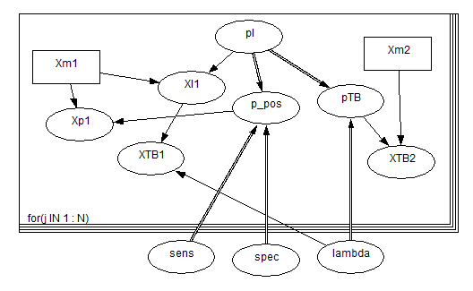

<!-- README.md is generated from README.Rmd. Please edit that file -->

```{r, include = FALSE}
knitr::opts_chunk$set(
  collapse = TRUE,
  comment = "#>",
  fig.path = "man/figures/README-",
  out.width = "100%"
)
```

# EvidSynthTB: Evidence synthesis of TB data

<!-- badges: start -->
[](https://lifecycle.r-lib.org/articles/stages.html#experimental)
<!-- badges: end -->

The goal of EvidSynthTB is to use Bayesian Multi-Parameter Evidence Synthesis (MPES) to estimate TB epidemiological parameters LTBI prevalence and active TB progression rate.

## Installation

You can install the development version from [GitHub](https://github.com/) with:

``` r
# install.packages("devtools")
devtools::install_github("n8thangreen/EvidSynthTB")
```

## Data

Input data sets used in this analysis are:

- Enhanced TB Surveillance (ETS)
- PREDICT-TB


## General model

We want to obtain posterior distributions for LTBI prevalence, `pl`, and active TB activation rate, `lambda`. The other model parameters are:

- `Xm1`: Cohort size (observed)
- `Xp1`: Number positive test results (observed)
- `Xl1`: Number latent TB (unobserved)
- `XTB1`: Number active TB (observed)
- `Xm2`: Cohort size (observed)
- `XTB2`: Number active TB (observed) 
- `p_pos`: Test positivity (functional)
- `pTB`: Probability active TB (functional)
- `sens`, `spec`: Test sensitivity and specificity (prior)

A Directed Acyclic Graph of the model is given below.




## Example

This is a basic example which shows you how to solve a common problem.
Fit markov melding model using Stan with simulated artificial LTBI and TB progression data without covariate (age or ethnicity).

```{r load-packages, warning=FALSE, message=FALSE}
library(rstan)
library(shinystan)
library(purrr)
library(readr)
library(dplyr)
library(EvidSynthTB)
```

We generate some fake data.

```{r fake-data}
# sample size
N <- 500

# disease-free censoring additional time
t_offset <- 10

# prevalence of ltbi
p_ltbi <- 0.3

shape0 <- 0.1
rate0 <- 0.1

# progression from LTBI to active tb times
progression_dat <-
  data.frame(
    t = round(flexsurv::rgompertz(N, shape = shape0, rate = rate0), 3)) |>
    mutate(x = rbinom(n = N, size = 1, prob = p_ltbi),   # ltbi status
           ## observe all progression times
           d = ifelse(x == 1, 1, 0),                     # censoring status
           # d = sample(c(0,1), size = N, replace = TRUE),
           # d = ifelse(x == 0, 0, d),
           t = ifelse(x == 0, t + t_offset, t)) |>       # time
  as_tibble()

# prevalence of LTBI
prevalence_dat <-
  data.frame(mu_hat = boot::logit(rnorm(n = 10, mean = 0.3, sd = 0.05)),
             sigma_hat = 0.01)
```

We can now use the prevalence data and progression data to obtain posterior distributions.

```{r model-fit}
out <- evidsynth_fit(prevalence_dat, progression_dat)
```

We can view the output.

```{r plots, warning=FALSE, message=FALSE}
library(reshape2)
library(ggplot2)

plot_progression(out)

# LTBI prevalence
stan_output <- extract(out$fit)

hist(stan_output$prev_cf, breaks = 40)
```
