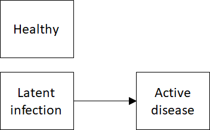
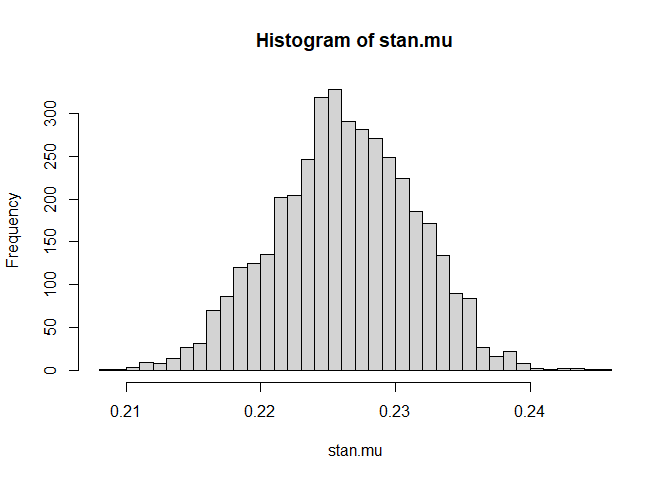

<!-- README.md is generated from README.Rmd. Please edit that file -->

# EvidSynthTB: Evidence synthesis of TB data

<!-- badges: start -->

[](https://lifecycle.r-lib.org/articles/stages.html#experimental)
<!-- badges: end -->

The goal of EvidSynthTB is to use Bayesian Multi-Parameter Evidence
Synthesis (MPES) to estimate TB epidemiological parameters LTBI
prevalence and active TB progression rate.

## Installation

You can install the development version from
[GitHub](https://github.com/n8thangreen/EvidSynthTB) with:

``` r
# install.packages("devtools")
devtools::install_github("n8thangreen/EvidSynthTB")
```

## General model structure

The framework provided by this package is more general that just applied
to TB and can be generally thought of as consisting of two key
components. The first is the uncertain starting state occupancy
distribution. We assume that we do not directly observed the proportion
of individuals in each state at time 0. The second is the uncertain
probability of transition from the latent infection state to the active
disease state. This is unknown because of the starting state
distribution and other survival analysis uncertainty including right
censored times.,

The diagram below depicts this model structure.



## Mathematical formalisation

More formally, the two components can be thought of as two parts of a
likelihood.

1.  A mixture cure model
2.  The starting state occupancy is represented by a binomial cure
    fraction model

We provide 3 ways of specifying the model within this general structure.
They differ by how the information from one componenet is shared or
influences the other.

## Joint, independent and cut models

#### Joint model

In this model there is free flow of information between components. That
is both models are fit simultaneously and all of the data are used for
both.

$$
L_0 = \left[ (1 - \pi) f_u(t_i) \right]^{d_i} \left[ \pi + (1 - \pi) S_u(t_i) \right]^{1-d_i}
$$

where $\pi$ is the cure fraction, $d_i$ are the censoring identifiers,
$S_u$ is the uncured survival function, $f_u$ is the uncured density
function, and $t_i$ is the event time of either progression or end of
follow up. Starting state are represented by
$x \sim \mbox{Bin}(\pi, N)$, i.e.

$$
L_{\pi} = \pi^x (1 - \pi)^{N - x}
$$ We will work on the logit scale for $\pi$ in terms of $\mu, \epsilon$
so that

$$
\mbox{logit}(\pi) = \mu + \epsilon \\
\epsilon \sim N(0, \sigma^2)
$$

#### Independent model

This assumes disjoint models which are fit separately so that two
probability of latent infection probabilities are inferred $\pi$ and
$\pi_0$. There is no connection between modules and so no flow of
information.

$$
L_0 = \left[ (1 - \pi_0) f_u(t_i) \right]^{d_i} \left[ \pi_0 + (1 - \pi_0) S_u(t_i) \right]^{1-d_i}
$$

$$
L_{\pi} = \pi^x (1 - \pi)^{N - x}
$$

#### Cut-point model

\[ref\]

The model allow the information contained in the data to only flow in
one direction. This allows for ‘stronger’ data to influence other
modules but for ‘weaker’ or corrupted or noisy data to be restricted in
terms of its influence. This may be appropriate for the TB model because
the Latent TB data may be more reliable, coming from studies, and the
population level progression data may be less reliable because of the
case mix, missing data etc.

Thus, the basic idea is to cut feedback from the active disease
progression component to the latent infection/state occupancy component.

$$
L_{\pi} = \phi(\hat{\mu} \mid \mbox{logit}(\pi), \hat{\sigma}^2)
$$

## TB data

The input data sets used in this analysis can come from several
different sources. For development and testing we generated fake data
with the same characteristics of the real world data. Secondly, we can
obtain data from published literature. The LTBI data are given in tables
and the time to event data can be estimated by digitising published
survival curves \[Abubaker\]. Finally, when available the individual
level data can be used directly from the original sources. In the UK
context, this includes:

1.  PREDICT-TB
2.  [https://www.gov.uk/government/statistics/reports-of-cases-of-tb-to-uk-enhanced-tuberculosis-surveillance-systems](Enhanced%20TB%20Surveillance%20(ETS))

## General TB model

We now describe a full statistical model which incorporates the
different components already introduced. We want to obtain posterior
distributions for LTBI prevalence, `pl`, and active TB activation rate,
`lambda`. The other model parameters are:

- `Xm1`: Cohort size (observed)
- `Xp1`: Number positive test results (observed)
- `Xl1`: Number latent TB (unobserved)
- `XTB1`: Number active TB (observed)
- `Xm2`: Cohort size (observed)
- `XTB2`: Number active TB (observed)
- `p_pos`: Test positivity (functional)
- `pTB`: Probability active TB (functional)
- `sens`, `spec`: Test sensitivity and specificity (prior)

A Directed Acyclic Graph of the model is given below. Simpler model can
be derived from this more general model, for instance by assuming that
the diagnostic test perform perfectly and so have fixed, known
sensitivity and specificity.


## Examples

### Fake data

This is a basic example which shows you how to solve a common problem.
Fit markov melding model using Stan with simulated artificial LTBI and
TB progression data without covariate (age or ethnicity).

``` r
library(rstan)
library(shinystan)
library(purrr)
library(readr)
library(dplyr)
library(EvidSynthTB)
```

We generate some fake data.

``` r
# sample size
N <- 500

# disease-free censoring additional time
t_offset <- 10

# prevalence of ltbi
p_ltbi <- 0.3

shape0 <- 0.1
rate0 <- 0.1

# progression from LTBI to active tb times
progression_dat <-
  data.frame(
    t = round(flexsurv::rgompertz(N, shape = shape0, rate = rate0), 3)) |>
    mutate(x = rbinom(n = N, size = 1, prob = p_ltbi),   # ltbi status
           ## observe all progression times
           d = ifelse(x == 1, 1, 0),                     # censoring status
           # d = sample(c(0,1), size = N, replace = TRUE),
           # d = ifelse(x == 0, 0, d),
           t = ifelse(x == 0, t + t_offset, t)) |>       # time
  as_tibble()

# prevalence of LTBI
prevalence_dat <-
  data.frame(mu_hat = boot::logit(rnorm(n = 10, mean = 0.3, sd = 0.05)),
             sigma_hat = 0.01)
```

We can now use the prevalence data and progression data to obtain
posterior distributions.

``` r
out <- evidsynth_fit(prevalence_dat, progression_dat)
#> 
#> SAMPLING FOR MODEL 'stan_output_fake_markov_melding' NOW (CHAIN 1).
#> Chain 1: 
#> Chain 1: Gradient evaluation took 0.000503 seconds
#> Chain 1: 1000 transitions using 10 leapfrog steps per transition would take 5.03 seconds.
#> Chain 1: Adjust your expectations accordingly!
#> Chain 1: 
#> Chain 1: 
#> Chain 1: WARNING: There aren't enough warmup iterations to fit the
#> Chain 1:          three stages of adaptation as currently configured.
#> Chain 1:          Reducing each adaptation stage to 15%/75%/10% of
#> Chain 1:          the given number of warmup iterations:
#> Chain 1:            init_buffer = 15
#> Chain 1:            adapt_window = 75
#> Chain 1:            term_buffer = 10
#> Chain 1: 
#> Chain 1: Iteration:    1 / 2000 [  0%]  (Warmup)
#> Chain 1: Iteration:  101 / 2000 [  5%]  (Sampling)
#> Chain 1: Iteration:  300 / 2000 [ 15%]  (Sampling)
#> Chain 1: Iteration:  500 / 2000 [ 25%]  (Sampling)
#> Chain 1: Iteration:  700 / 2000 [ 35%]  (Sampling)
#> Chain 1: Iteration:  900 / 2000 [ 45%]  (Sampling)
#> Chain 1: Iteration: 1100 / 2000 [ 55%]  (Sampling)
#> Chain 1: Iteration: 1300 / 2000 [ 65%]  (Sampling)
#> Chain 1: Iteration: 1500 / 2000 [ 75%]  (Sampling)
#> Chain 1: Iteration: 1700 / 2000 [ 85%]  (Sampling)
#> Chain 1: Iteration: 1900 / 2000 [ 95%]  (Sampling)
#> Chain 1: Iteration: 2000 / 2000 [100%]  (Sampling)
#> Chain 1: 
#> Chain 1:  Elapsed Time: 1.455 seconds (Warm-up)
#> Chain 1:                34.378 seconds (Sampling)
#> Chain 1:                35.833 seconds (Total)
#> Chain 1:
```

We can view the output.

``` r
library(reshape2)
library(ggplot2)

plot_progression(out)
```


``` r

# LTBI prevalence
stan_output <- extract(out$fit)

hist(stan_output$prev_cf, breaks = 40)
```


### Real data

From Abubakar (2018)

``` r
library(rstanarm)
#> Loading required package: Rcpp
#> This is rstanarm version 2.26.1
#> - See https://mc-stan.org/rstanarm/articles/priors for changes to default priors!
#> - Default priors may change, so it's safest to specify priors, even if equivalent to the defaults.
#> - For execution on a local, multicore CPU with excess RAM we recommend calling
#>   options(mc.cores = parallel::detectCores())
#> 
#> Attaching package: 'rstanarm'
#> The following object is masked from 'package:rstan':
#> 
#>     loo

dat <- data.frame(y = 1444, n = 1444+4936)

# expected value
dat$y/dat$n
#> [1] 0.2263323

fit <- stan_glm(formula = formula("cbind(y, n - y) ~ 1"),
                data = dat,
                family = binomial(link = "logit"))
stan.mu <- posterior_epred(fit)

hist(stan.mu, breaks = 40)
```



The posterior distribution for LTBI prevalence is then plugged-in to the
`evidsynth_fit()` as before.

``` r
progression_dat <- read.table("raw-data/IPDdata.txt")
```
