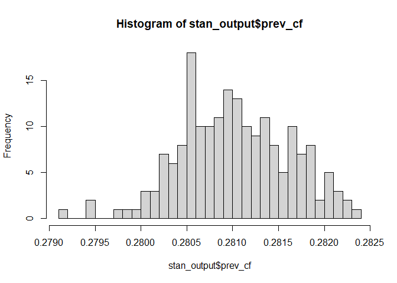

<!-- README.md is generated from README.Rmd. Please edit that file -->

# EvidSynthTB: Evidence synthesis of TB data

<!-- badges: start -->

[](https://lifecycle.r-lib.org/articles/stages.html#experimental)
<!-- badges: end -->

The goal of EvidSynthTB is to use Bayesian Multi-Parameter Evidence
Synthesis (MPES) to estimate TB epidemiological parameters LTBI
prevalence and active TB progression rate.

## Installation

You can install the development version from
[GitHub](https://github.com/) with:

``` r
# install.packages("devtools")
devtools::install_github("n8thangreen/EvidSynthTB")
```

## General model structure

The framework provided by this package is more general that just applied
to TB and can be generally thought of as consisting of two key
components. The first is the uncertain starting state occupancy
distribution. We assume that we do not directly observed the proportion
of individuals in each state at time 0. The second is the uncertain
probability of transition from the latent infection state to the active
disease state. This is unknown because of the starting state
distribution and other survival analysis uncertainty including right
censored times.,

The diagram below depicts this model structure.


## Mathematical formalisation

More formally, the two components can be thought of as two parts of a
likelihood.

- A mixture cure model
- The starting state occupancy is represented by a binomial cure
  fraction model

## Joint, independent and cut models

- Joint model

Free flow between components

$$
L_0 = \left[ (1 - \pi) f_u(t_i) \right]^{d_i} \left[ \pi + (1 - \pi) S_u(t_i) \right]^{1-d_i}
$$

where $\pi$ is the cure fraction, $d_i$ are the censoring identifiers,
$S_u$ is the uncured survival function, $f_u$ is the uncured density
function, and $t_i$ is the event time of either progression or end of
follow up.

$$
L_{\pi} = \mbox{Bin}(x \mid \mu, \sigma^2)
$$

- Independent model

Disjoint models fit separately so that two probability of latent
infection probabilities are inferred $\pi$ and $\pi_0$.

$$
L_0 = \left[ (1 - \pi_0) f_u(t_i) \right]^{d_i} \left[ \pi_0 + (1 - \pi_0) S_u(t_i) \right]^{1-d_i}
$$

$$
L_{\pi} = \mbox{Bin}(x \mid \mu, \sigma^2)
$$

- Cut-point model

\[ref\]

The idea is to cut feedback from the active disease progression
component to the latent infection/state occupancy component.

$$
L_{\pi} = \phi(\hat{\mu} \mid \mbox{logit}(\pi), \hat{\sigma}^2)
$$

## TB data

Input data sets used in this analysis are:

- Enhanced TB Surveillance (ETS)
- PREDICT-TB

## General TB model

We want to obtain posterior distributions for LTBI prevalence, `pl`, and
active TB activation rate, `lambda`. The other model parameters are:

- `Xm1`: Cohort size (observed)
- `Xp1`: Number positive test results (observed)
- `Xl1`: Number latent TB (unobserved)
- `XTB1`: Number active TB (observed)
- `Xm2`: Cohort size (observed)
- `XTB2`: Number active TB (observed)
- `p_pos`: Test positivity (functional)
- `pTB`: Probability active TB (functional)
- `sens`, `spec`: Test sensitivity and specificity (prior)

A Directed Acyclic Graph of the model is given below.


## Example

This is a basic example which shows you how to solve a common problem.
Fit markov melding model using Stan with simulated artificial LTBI and
TB progression data without covariate (age or ethnicity).

``` r
library(rstan)
library(shinystan)
library(purrr)
library(readr)
library(dplyr)
library(EvidSynthTB)
```

We generate some fake data.

``` r
# sample size
N <- 500

# disease-free censoring additional time
t_offset <- 10

# prevalence of ltbi
p_ltbi <- 0.3

shape0 <- 0.1
rate0 <- 0.1

# progression from LTBI to active tb times
progression_dat <-
  data.frame(
    t = round(flexsurv::rgompertz(N, shape = shape0, rate = rate0), 3)) |>
    mutate(x = rbinom(n = N, size = 1, prob = p_ltbi),   # ltbi status
           ## observe all progression times
           d = ifelse(x == 1, 1, 0),                     # censoring status
           # d = sample(c(0,1), size = N, replace = TRUE),
           # d = ifelse(x == 0, 0, d),
           t = ifelse(x == 0, t + t_offset, t)) |>       # time
  as_tibble()

# prevalence of LTBI
prevalence_dat <-
  data.frame(mu_hat = boot::logit(rnorm(n = 10, mean = 0.3, sd = 0.05)),
             sigma_hat = 0.01)
```

We can now use the prevalence data and progression data to obtain
posterior distributions.

``` r
out <- evidsynth_fit(prevalence_dat, progression_dat)
#> 
#> SAMPLING FOR MODEL 'stan_output_fake_markov_melding' NOW (CHAIN 1).
#> Chain 1: 
#> Chain 1: Gradient evaluation took 0.000409 seconds
#> Chain 1: 1000 transitions using 10 leapfrog steps per transition would take 4.09 seconds.
#> Chain 1: Adjust your expectations accordingly!
#> Chain 1: 
#> Chain 1: 
#> Chain 1: WARNING: There aren't enough warmup iterations to fit the
#> Chain 1:          three stages of adaptation as currently configured.
#> Chain 1:          Reducing each adaptation stage to 15%/75%/10% of
#> Chain 1:          the given number of warmup iterations:
#> Chain 1:            init_buffer = 15
#> Chain 1:            adapt_window = 75
#> Chain 1:            term_buffer = 10
#> Chain 1: 
#> Chain 1: Iteration:    1 / 2000 [  0%]  (Warmup)
#> Chain 1: Iteration:  101 / 2000 [  5%]  (Sampling)
#> Chain 1: Iteration:  300 / 2000 [ 15%]  (Sampling)
#> Chain 1: Iteration:  500 / 2000 [ 25%]  (Sampling)
#> Chain 1: Iteration:  700 / 2000 [ 35%]  (Sampling)
#> Chain 1: Iteration:  900 / 2000 [ 45%]  (Sampling)
#> Chain 1: Iteration: 1100 / 2000 [ 55%]  (Sampling)
#> Chain 1: Iteration: 1300 / 2000 [ 65%]  (Sampling)
#> Chain 1: Iteration: 1500 / 2000 [ 75%]  (Sampling)
#> Chain 1: Iteration: 1700 / 2000 [ 85%]  (Sampling)
#> Chain 1: Iteration: 1900 / 2000 [ 95%]  (Sampling)
#> Chain 1: Iteration: 2000 / 2000 [100%]  (Sampling)
#> Chain 1: 
#> Chain 1:  Elapsed Time: 0.315 seconds (Warm-up)
#> Chain 1:                40.803 seconds (Sampling)
#> Chain 1:                41.118 seconds (Total)
#> Chain 1:
#> Warning: There were 1 chains where the estimated Bayesian Fraction of Missing Information was low. See
#> https://mc-stan.org/misc/warnings.html#bfmi-low
#> Warning: Examine the pairs() plot to diagnose sampling problems
```

We can view the output.

``` r
library(reshape2)
library(ggplot2)

plot_progression(out)
```


``` r

# LTBI prevalence
stan_output <- extract(out$fit)

hist(stan_output$prev_cf, breaks = 40)
```


