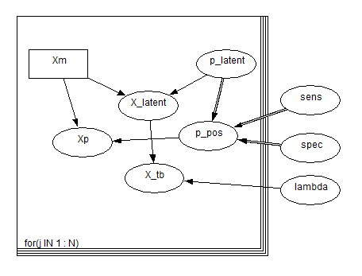
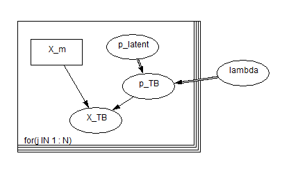
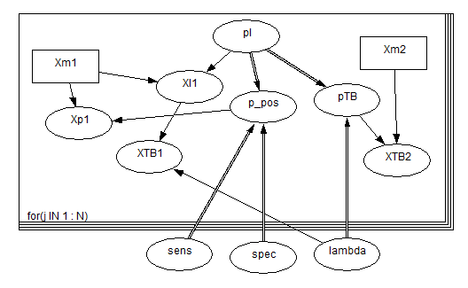
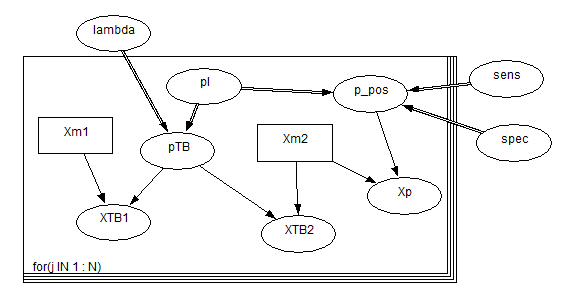

```{r setup, include=FALSE}
knitr::opts_chunk$set(echo = TRUE)
```

### Introduction

We have several data sources which can inform the estimation of LTBI prevalence in subpopulations.
We will formulate a Bayesian evidence synthesis model to do this.

### Model with screening and progression count data (e.g. PREDICT)

Define a group to be a combination of multiple values across covariates.
For example, a 16 to 18 years old, white British male.
We will fit separate models to each group in the following. A regression model with group covariates could be developed.
We assume that the LTBI test sensitivity and specificity is the same for all groups.
We also assume that the probability of progressing to active TB is the same for all groups.
For $N$ groups the model formulae are

\begin{eqnarray*}
X_l(j) &\sim& Bin(X_m(j), p_l(j))\\
p_{+}(j) &=& p_l(j) \times sens + (1-p_l(j)) \times (1-spec)\\
X_p(j) &\sim& Bin(X_m(j), p_+(j))\\
X_{TB}(j) &\sim& Bin(X_l(j), \lambda)
\end{eqnarray*}

where
$j$ is the group index,
$X_l$ is the (unobserved) number of LTBI individuals,
$X_m$ is the observed number of migrants i.e. the total sample,
$X_p$ is the observed number of positive tests in the migrant population,
$X_{TB}$ is the observed number of active TB cases,
$p_l$ is the probability of having LTBI i.e. prevalence,
$p_+$ is the test positivity,
$\lambda$ is the proportion of LTBI individuals who progress to active TB (in the total time at risk),
$sens$ is the test sensitivity,
$spec$ is the test specificity.

The Directed Acyclic Graph (DAG) for this model is given below.




The main model BUGS code is given below.

```r
## LTBI screening evidence synthesis model ----

model {

  for (j in 1:len_gp) {

      X_latent[j] ~ dbin(p_latent[j], Xm[j])
      p_pos[j] <- (p_latent[j]*sens) + (1 - p_latent[j])*(1 - spec)
      Xp[j] ~ dbin(p_pos[j], Xm[j])
      Xtb[j] ~ dbin(lambda, X_latent[j])
    }
}
```

#### Prior distributions

Vague prior were used in the first instance.
When fitting to the actual real-life data we will have informative priors for the test performance, progression rates and prevalence within groups from previous studies.

\begin{eqnarray*}
sens &\sim& Beta(a_{sens}, b_{sens})\\
sens &\sim& Beta(a_{spec}, b_{spec})\\
\lambda &\sim& Beta(a_{\lambda}, b_{\lambda})\\
logit(p_l) &\sim& Normal(0, \sigma^2_l) 
\end{eqnarray*}

The corresponding BUGS code is given below.

```r
sens ~ dbeta(100, 5)   # mean 0.96
spec ~ dbeta(100, 5)   # mean 0.96
lambda ~ dbeta(5, 100) # mean 0.05

# this is not a robust prior
for (j in 1:len_gp) {
  logitp_latent[j] ~ dnorm(0, 0.001)
  p_latent[j] <- exp(logitp_latent[j]) / (1 + exp(logitp_latent[j]))
}
```


### Running the WinBUGS model from R

For simplicity, we demonstrate the model on dummy data.
We have two groups $j = 1, 2$.

```{r message=FALSE, warning=FALSE, results=FALSE}
library(R2jags)
library(R2WinBUGS)
library(purrr)
```


```{r}
dat <- read.csv(here::here("data input", "PREDICT_dummy.csv"), header = TRUE)

jags_dat_input <-
  list(
    len_gp = nrow(dat),                   # number of groups
    Xm  = dat$n_migrant,                  # number of migrants
    Xp  = dat$n_pos,                      # number of positive test results
    Xtb = dat$n_tb                        # number of observed active tb cases
  )

jags_dat_input

params <-
  c("sens", "spec",
    "lambda",
    "p_latent"
  )

n_iter <- 1e6
n_burnin <- 1e3
n_thin <- 1e2 #floor((n_iter - n_burnin)/500)
```

Finally, run the MCMC. We specify 2 chains, a burn-in period, thinning rate and which parameters to monitor.

```{r message=FALSE, results=FALSE, cache=TRUE}
out <- jags(jags_dat_input,
            parameters.to.save = params,
            model.file = here::here("scripts", "BUGS_code_Xl_distn.txt"),
            n.chains = 2,
            n.iter = n_iter,
            n.burnin = n_burnin,
            n.thin = n_thin,
            DIC = TRUE,
            working.directory = here::here("scripts"),
            progress.bar = "text")
```


### Evaluate output

We will use the plotting functions from the [`MCMCvis`](https://cran.r-project.org/web/packages/MCMCvis/vignettes/MCMCvis.html) package.
The priors are the red lines.

```{r message=FALSE, warning=FALSE}
library(MCMCvis)

n_sample <- (n_iter-n_burnin)/n_thin

## sample from priors ----

sens <- rbeta(n = n_sample, shape1 = 100, shape2 = 5)
spec <- rbeta(n = n_sample, shape1 = 100, shape2 = 5)
lambda <- rbeta(n = n_sample, shape1 = 5, shape2 = 100)
logitp_latent <- rnorm(n = n_sample, mean = 0, sd = 1/0.001)
p_latent <- exp(logitp_latent) / (1 + exp(logitp_latent))
p_latent[is.nan(p_latent)] <- 0 #remove NaN
```

Trace plots and prior-posterior density plots are shown below.

```{r message=FALSE, warning=FALSE}
MCMCtrace(out,
          pdf = FALSE,
          ind = TRUE,
          iter = n_sample,
          params = c("lambda", "sens", "spec", "p_latent"),
          priors = as.matrix(data.frame(lambda, sens, spec, p_latent, p_latent)))
```

A posterior forest plot is shown below.

```{r message=FALSE}
MCMCplot(out,
         params = c("sens", "spec", "lambda", "p_latent"))
```

Using the `coda` package, BGR plots are show below.

```{r fig.height=20, fig.width=15, message=FALSE}
coda::gelman.plot(mcmcplots::as.mcmc.rjags(out), cex = 2, cex.main = 3)
```


#### Functional $X_l$

The estimate for $X_l$ is made as a likelihood in the above model.
It may make more sense to have it as a functional relationship of migrant populations and probability of LTBI, since estimating $p_l$ and $X_l$ is unobserved.
This has the problem that it must be an integer value to then be used in the Binomial distribution.
One solution is simply to round down the product, giving

\begin{eqnarray*}
X_l(j) &=& \lfloor X_m(j) \times p_l(j) \rfloor
\end{eqnarray*}

The remaining model is exactly the same as above. The output is given below.

```{r echo=FALSE, message=FALSE, results=FALSE, cache=TRUE}
out <- jags(jags_dat_input,
            parameters.to.save = params,
            model.file = here::here("scripts", "BUGS_code_Xl_fn.txt"),
            n.chains = 2,
            n.iter = n_iter,
            n.burnin = n_burnin,
            n.thin = n_thin,
            DIC = TRUE,
            working.directory = here::here("scripts"),
            progress.bar = "text")
```

```{r echo=FALSE, message=FALSE, warning=FALSE}
MCMCtrace(out,
          pdf = FALSE,
          ind = TRUE,
          iter = n_sample,
          params = c("lambda", "sens", "spec", "p_latent"),
          priors = as.matrix(data.frame(lambda, sens, spec, p_latent, p_latent)))
```

```{r echo=FALSE, message=FALSE}
MCMCplot(out,
         params = c("sens", "spec", "lambda", "p_latent"))
```

```{r echo=FALSE, fig.height=20, fig.width=15, message=FALSE}
coda::gelman.plot(mcmcplots::as.mcmc.rjags(out))
```


### Model with progression data only (e.g. PES-ETS)

Now assume that we do not observe the LTBI positivity of a cohort of individuals followed-up over time.
We parameterise the model so that the probability of active TB is the product of LTBI infection and progression.
Using the same notation as above, the new formula is

\begin{eqnarray*}
X_{TB}(j) &\sim& Bin(X_m(j), p_l(j) \times \lambda)
\end{eqnarray*}

The DAG for this model is given below.



The BUGS code is as follows.


```r
model {

  for (j in 1:len_gp) {

      Xtb[j] ~ dbin(p_TB[j], Xm[j])
      p_TB[j] <- lambda*p_latent[j]
    }
}
```
with the same priors on $\lambda$ and $p_l$ as before.
For exposition, we will use the same data as before but now we do not observe the test results.
This therefore gives the following inputs.

```{r}
jags_dat_input <-
  list(
    len_gp = nrow(dat),
    Xm  = dat$n_migrant,
    Xtb = dat$n_tb
  )

params <-
  c("lambda",
    "p_latent")
```

```{r echo=FALSE, message=FALSE, results=FALSE, cache=TRUE}
out <- jags(jags_dat_input,
            parameters.to.save = params,
            model.file = here::here("scripts", "BUGS_code_ETS.txt"),
            n.chains = 2,
            n.iter = n_iter,
            n.burnin = n_burnin,
            n.thin = n_thin,
            DIC = TRUE,
            working.directory = here::here("scripts"),
            progress.bar = "text")
```

The output is given below.

```{r echo=FALSE, message=FALSE, warning=FALSE}
MCMCtrace(out,
          pdf = FALSE,
          ind = TRUE,
          iter = n_sample,
          params = c("lambda", "p_latent"),
          priors = as.matrix(data.frame(lambda, p_latent, p_latent)))
```

```{r echo=FALSE, message=FALSE}
MCMCplot(out,
         params = c("lambda", "p_latent"))
```

```{r echo=FALSE, fig.height=20, fig.width=15, message=FALSE}
coda::gelman.plot(mcmcplots::as.mcmc.rjags(out))
```


### Evidence synthesis model (e.g. PREDICT and PES-ETS)

We can now combine the two separate models to create a single model which uses both data sources simultaneously.

The DAG for the model with $X_l$ sampled is given below.



The DAG for a deterministic functional form is




#### Datasets in agreement

First, create the input data variable, where there are now two rows in $X_m$ and $X_{tb}$ corresponding to different datasets.

```{r}
jags_dat_input <-
  list(
    len_gp = nrow(dat),             # number of groups
    Xm  = rbind(dat$n_migrant,
                dat$n_migrant),     # number of migrants
    Xp  = dat$n_pos,                # number of positive test results
    Xtb = rbind(dat$n_tb,
                dat$n_tb)           # number of observed active tb cases
  )

jags_dat_input

params <-
  c("sens", "spec",
    "lambda",
    "p_latent"
  )
```

```{r message=FALSE, results=FALSE, cache=TRUE}
out <- jags(jags_dat_input,
            parameters.to.save = params,
            model.file = here::here("scripts", "BUGS_code_full_Xl_fn.txt"),
            n.chains = 2,
            n.iter = n_iter,
            n.burnin = n_burnin,
            n.thin = n_thin,
            DIC = TRUE,
            working.directory = here::here("scripts"),
            progress.bar = "text")
```

The output is given below.

```{r echo=FALSE, message=FALSE, warning=FALSE}
MCMCtrace(out,
          pdf = FALSE,
          ind = TRUE,
          iter = n_sample,
          params = c("lambda", "sens", "spec", "p_latent"),
          priors = as.matrix(data.frame(lambda, sens, spec, p_latent, p_latent)))
```

```{r echo=FALSE, message=FALSE}
MCMCplot(out,
         params = c("sens", "spec", "lambda", "p_latent"))
```

```{r echo=FALSE, fig.height=20, fig.width=15, message=FALSE}
coda::gelman.plot(mcmcplots::as.mcmc.rjags(out))
```


#### Datasets in conflict

Now suppose that the two data source do not agree with each other.

```{r}
jags_dat_input$Xtb[2, ] <- c(100, 5) # vs c(30, 10)
```

```{r message=FALSE, results=FALSE, cache=TRUE}
out <- jags(jags_dat_input,
            parameters.to.save = params,
            model.file = here::here("scripts", "BUGS_code_full_Xl_fn.txt"),
            n.chains = 2,
            n.iter = n_iter,
            n.burnin = n_burnin,
            n.thin = n_thin,
            DIC = TRUE,
            working.directory = here::here("scripts"),
            progress.bar = "text")
```

The output is given below.

```{r echo=FALSE, message=FALSE, warning=FALSE}
MCMCtrace(out,
          pdf = FALSE,
          ind = TRUE,
          iter = n_sample,
          params = c("lambda", "sens", "spec", "p_latent"),
          priors = as.matrix(data.frame(lambda, sens, spec, p_latent, p_latent)))
```

```{r echo=FALSE, message=FALSE}
MCMCplot(out,
         params = c("sens", "spec", "lambda", "p_latent"))
```

```{r echo=FALSE, fig.height=20, fig.width=15, message=FALSE}
coda::gelman.plot(mcmcplots::as.mcmc.rjags(out))
```


#### LTBI prevalence regression model

Rather than have a stratified model with a prior on the probability of latent TB, $p_l$, we can have a regression model with priors on the coefficients of a fixed-effects linear equation.

$$
logit(p_l) = \beta_0 + \beta_1 sex + \beta_{21} ethn_1 + \beta_{22} ethn_2 + \cdots + \beta_{31} agegrp_1 + \beta_{32} agrgrp_2 + \cdots
$$

This now also allows us to estimate expected prevalence for unobserved categories.
